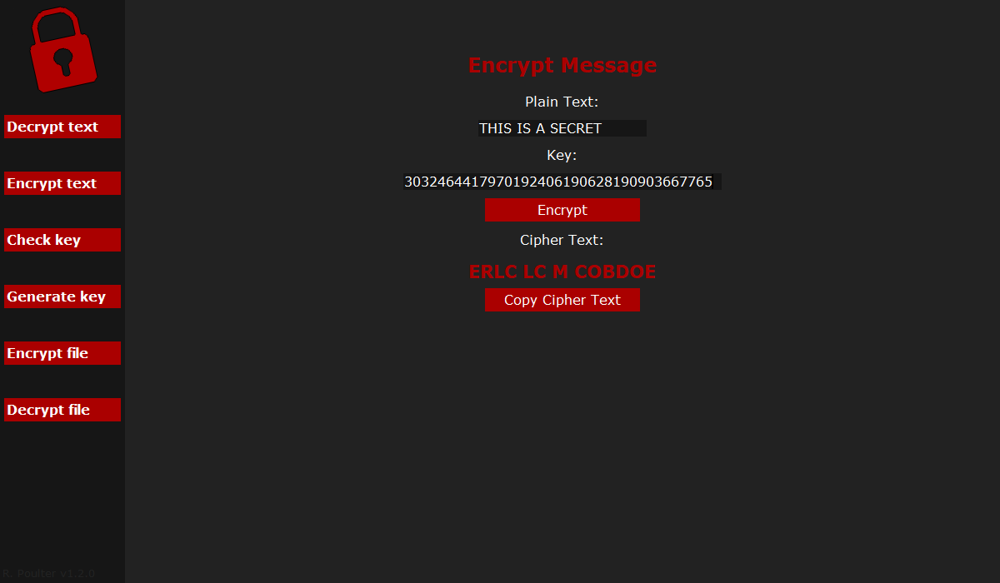
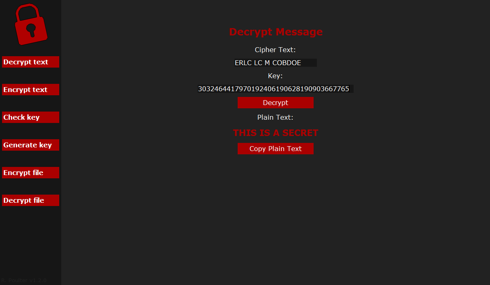
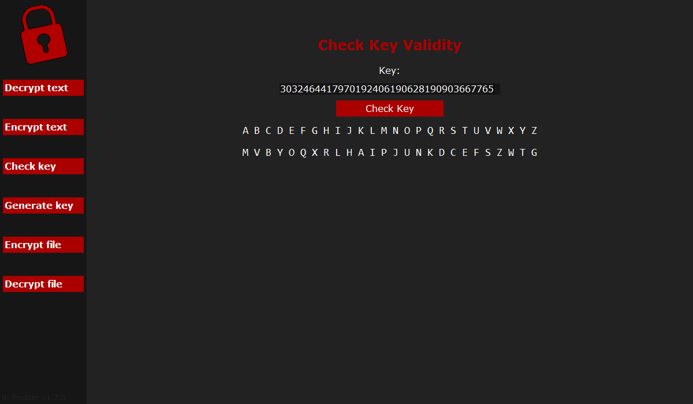
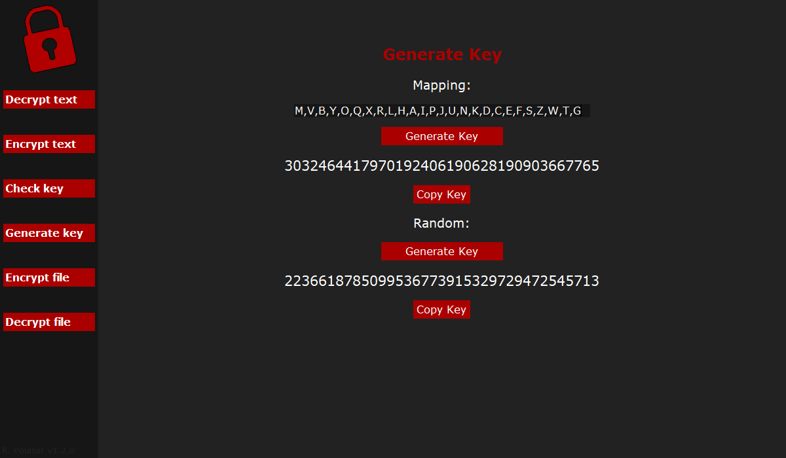

# Encryption-Program
Python program used to encrypt and decrypt text and .txt files using a custom cipher.

The program has 6 functions:
- Encrypting text
- Decrypting text
- Validating keys
- Generating keys
- Encrypting .txt files
- Decrypting .txt files

The cipher is difficult to crack without knowing how it works, as it has over **_403 SEPTILLION_** possible keys.
## Installation
Use the package manager [pip](https://pip.pypa.io/en/stable/) to install the required packages.
```bash
pip install -r /path/to/requirements.txt
```
Or run the file `setup.cmd`
## Usage
### Encrypting Text

- Open the "Encrypt file" tab on the window
- Enter plain text
- Enter key
- Press "Encrypt"
- Copy cipher text or key to clipboard

### Decrypting Text

- Open the "Encrypt file" tab on the window
- Enter cipher text
- Enter key
- Press "Decrypt"
- Copy plain text to clipboard

### Validating Keys

- Open the "Check key" tab on the window
- Enter key
- Press "Check Key"
- If the key is valid, the letter mapping will be shown

### Generating Keys

- Open the "Generate key" tab on the window
#### Known Mapping
- Enter the mapping in the format *H,E,M,Q,K,Y,U,J,W,O,V,P,T,X,Z,D,F,C,S,B,N,I,G,R,L,A* where A maps to H, B maps to E, etc.
- Press "Generate Key"
- If the mapping is valid, the corresponding key will be generated
- Copy key to clipboard
#### Random
- Press "Generate Key"
- Copy key to clipboard

### Encrypting Files
- Open the "Encrypt file" tab on the window
- Select the file to be encrypted
  - Drag and drop the file into the box on the window from File Explorer
  - Press "Select File" and select the file from the file explorer
- Enter the key
- Press "Encrypt File" below the file name
- The encrypted file will contain the key used to encrypt/decrypt the text, followed by the encrypted text and will be stored in the directory `src/Encrypted and decrypted files`

### Decrypting Files
- Open the "Decrypt file" tab on the window
- Select the file to be decrypted
  - Drag and drop the file into the box on the window from File Explorer
  - Press "Select File" and select the file from the file explorer
- Press "Decrypt File" below the file name
- The decrypted file will contain decrypted text and will be stored in the directory `src/Encrypted and decrypted files`

## Development
Written in Python 3.10.\
Python version is fully functional.
